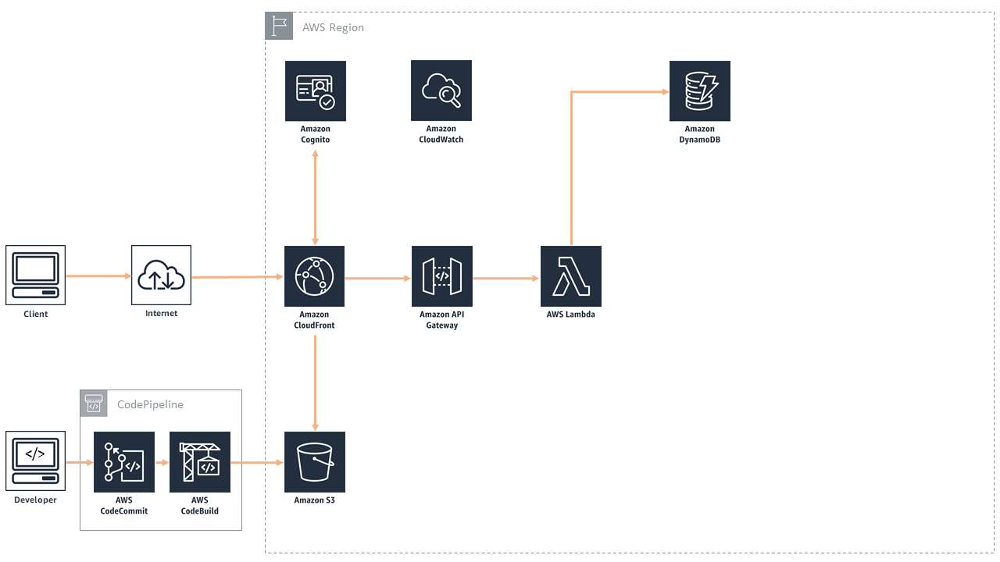

## Web Application Side of Health Concierge

The web application side of our overall application represents the database and primary health information pages. This was primarily built using a suite of AWS tools to handle user authentication, the database, and the hosting. The tools in the AWS stack we used were Cognito for authentication, S3 for the web asset storage, Lambda and API Gateway to handle arbitrary server functions, and DynamoDB for specific user data storage. The importance of having the two separate components to our total application was to take advantage of and illustrate the capabilities of a voice interface from the Google Assistant and the obviously feature-rich platform we could have from a traditional web application interface. The web application display fundamental dynamic components of register, sign in, login, information update, medication ordering, and video calling. The main pages we created for the application included the following pages: about, dashboard, doctor, and medications. 

The entire application - frontend, backend, and all configuration - is currenctly deployed in an AWS account with a single CloudFormation template

## AWS Architecture Used

The architecture diagram can be seen below:

CloudFormation automates the entire creation and deployment of the web application.  

**Database components**

Amazon DynamoDB

**Application components**

Amazon API Gateway powers the interface layer between the frontend and backend, and invokes serverless compute with AWS Lambda.  

**Infrastructure components**

AWS CodePipeline and AWS CodeBuild for a continuous deployment code pipeline
Amazon CloudFront and Amazon S3 setup for serverless web application 

**Summary diagram**

&nbsp;

**High-level, end-to-end diagram**

